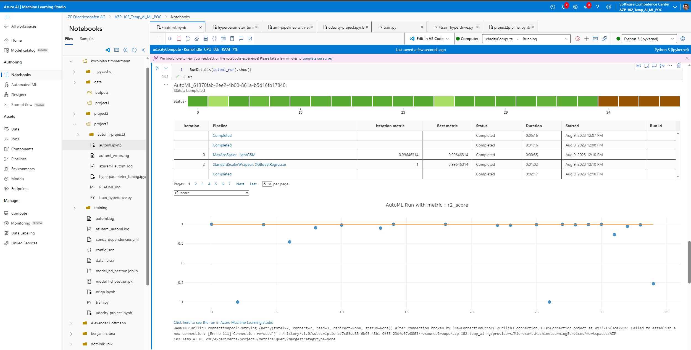

*NOTE:* This file is a template that you can use to create the README for your project. The *TODO* comments below will highlight the information you should be sure to include.

# C02 emmissions of cars

Introduction: In this Azure ML project, we aim to compare the performance of two different approaches for training a model to predict CO2 emissions of different car typs. The first approach involves using HyperDrive, which is a hyperparameter tuning technique, and the second approach involves using AutoML, which automates the process of model selection and hyperparameter tuning.

Methodology: To get started, we will upload the CO2 Emissions dataset into our Azure ML Studio workspace. We will then split the dataset into training and testing sets to evaluate the performance of the trained models.

## Project Set Up and Installation
All the enviroment dependecies could be found under the conda_enviroment.yml file

## Dataset
For this project, we will be using the CO2 Emissions dataset from Kaggle, which can be found at the following link: [Kaggle CO2 Emissions Dataset](https://www.kaggle.com/code/bhuviranga/linear-regression-co2-emissions/input).
### Overview
This dataset contains information about various features such as engine size, fuel type, and number of cylinders, which can be used to predict the CO2 emissions of a vehicle.

### Task
The task is to predict the C02 emission of a car by the given input features.


### Access
The data is loaded to the workspace and can be consumed via the workspace and the dataset name. (see jupyter notebook)

## Automated ML
For the autoML run a experiment timeout of 25 minutes where used. The primary metric was the R2 score and the problem which the model should solve is a regression task. For further details see the juypter notebook.

### Results
From the autoML run the best performing model was a decission tree algorithm of the typ XGBoostRegressor with a R2 score of 0.99675 and the following hyperparamters: 
``` python
{
    "class_name": "XGBoostRegressor",
    "module": "automl.client.core.common.model_wrappers",
    "param_args": [],
    "param_kwargs": {
        "booster": "gbtree",
        "colsample_bytree": 1,
        "eta": 0.5,
        "gamma": 0,
        "max_depth": 9,
        "max_leaves": 0,
        "n_estimators": 100,
        "objective": "reg:linear",
        "reg_alpha": 0,
        "reg_lambda": 2.3958333333333335,
        "subsample": 0.9,
        "tree_method": "auto"
    },
    "prepared_kwargs": {},
    "spec_class": "sklearn"
}
```
The model performance could basically first increase by increasing the timeout of the run. Initially this time was to short so a proper hyperparameter search could not take place. After increasing the time the early stopping policy could intervent.



*TODO* Remeber to provide screenshots of the `RunDetails` widget as well as a screenshot of the best model trained with it's parameters.

## Hyperparameter Tuning
Also for the hyperparameter task a decission tree model was choosen. The parameters which have to be tuned are the maximum depth of the tree and the minimum samples per leaf. Further information about decission tree models could be found within the [scikit learning plattform](https://scikit-learn.org/stable/modules/generated/sklearn.tree.DecisionTreeRegressor.html#sklearn.tree.DecisionTreeRegressor)  
For the hpyerparameter search the RandomParameterSampling class was used and the maximum depth should be within a range of 1 to 20 and for the minimum samples per leaf within a range of 1 to 4. See also the short code example:
``` python
param_sampling = RandomParameterSampling({
    '--max_depth': choice(1, 5, 10, 20),
    '--min_samples_leaf': choice(1, 2, 4)
})
```

### Results
The R2 score of the best hpyerparmeter tuned model was 0.9618546. With the parameters: 
``` python 
hyperparameters : {"--max_depth": 20, "--min_samples_leaf": 1} 
``` 
The model performance increases with the depth of the decission tree. So when I started the training process I did not used such a maximum depth of the decission tree but increased it after several experiements.

*TODO* Remeber to provide screenshots of the `RunDetails` widget as well as a screenshot of the best model trained with it's parameters.

## Model Deployment
For the deployment the model of the hyperdrive run was used.

First the model was register and then deployes as an endpoint.

To evaluate the performance of the deployed model, a HTTP inference requests is send to the model's URI. This will allow us to test the models with sample inputs and observe the responses.

For a faster developing and debugging it is suggested to use a LocalWebservice first and after this is running a ACI service can be deployed.

The then deployed AciWebservice can be then besically called via the Rest endpoint URL and the data can be dump as json formated data. This data will then be consumed by often called scoring python file. Within this file the data is preprocessed and transmitted to the underlying model.

``` python
import urllib.request
import json
import os
import ssl

def allowSelfSignedHttps(allowed):
    # bypass the server certificate verification on client side
    if allowed and not os.environ.get('PYTHONHTTPSVERIFY', '') and getattr(ssl, '_create_unverified_context', None):
        ssl._create_default_https_context = ssl._create_unverified_context

allowSelfSignedHttps(True) # this line is needed if you use self-signed certificate in your scoring service.

# Request data goes here
# The example below assumes JSON formatting which may be updated
# depending on the format your endpoint expects.
# More information can be found here:
# https://docs.microsoft.com/azure/machine-learning/how-to-deploy-advanced-entry-script
data = {"data":
        [
          {"Engine Size(L)":2.0,
          "Cylinders":4.0,
          "Fuel Consumption City (L\\/100 km)":9.9,
          "Fuel Consumption Hwy (L\\/100 km)":8.3
          }
      ]
    }

body = str.encode(json.dumps(data))

#this is the rest endpoint url of the model
url = 'http://710c509e-7035-4f07-9a45-c025e84ddcb8.westeurope.azurecontainer.io/score'


headers = {'Content-Type':'application/json'}

req = urllib.request.Request(url, body, headers)

try:
    response = urllib.request.urlopen(req)

    result = response.read()
    print(result)
except urllib.error.HTTPError as error:
    print("The request failed with status code: " + str(error.code))

    # Print the headers - they include the requert ID and the timestamp, which are useful for debugging the failure
    print(error.info())
    print(error.read().decode("utf8", 'ignore'))
``` 

## Screen Recording
Here is the link to the screenrecording: 
[Capstone project](https://youtu.be/LHFRR1teG8M)

## Standout Suggestions
*TODO (Optional):* This is where you can provide information about any standout suggestions that you have attempted.
